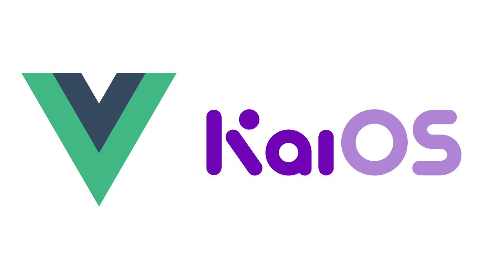

> **Vue component library for KaiOS apps.**


- [Installation](#installation)
- [Usage / API](#usage--api)
  - [Example](#example)
  - [Styles](#styles)
- [Status](#status)
  - [Components](#components)
  - [Navigation](#navigation)
  - [Typography](#typography)
  - [Miscellaneous](#miscellaneous)
- [Styling, Colors, Fonts](#styling-colors-fonts)
- [Icons](#icons)
- [Contributing](#contributing)

# Installation
```
npm install vue-kaiui
```
In your `main.js` add

```javascript
import Vue from 'vue'
import App from './App.vue'

import VueKaiUI from "vue-kaiui"; // !
Vue.use(VueKaiUI) // !

new Vue({
  render: h => h(App),
}).$mount('#app')
```

# Usage / API
See the [Components API docs](https://github.com/sebastianbaar/vue-kaiui/tree/master/docs/) and the [sample App](https://github.com/sebastianbaar/vue-kaiui-sample) for usage examples.

## Example
Most importantly put all the components in the `<kaiui-content>` root so that the library can manage all the Softkeys and Header design elements for you. The structure may look like this:

```html
<template>
  <kaiui-content> <!-- IMPORTANT root element -->
    <kaiui-header title="ToDo List" />
    <kaiui-tabs>
      <kaiui-tab-item name="Item One" selected>
        <kaiui-text
          text="This is a standard Text element with a lot of Text in it. Hope you like it. Enjoy!"
        />
        <kaiui-input
          v-on:input="onInputChanged"
          label="Add a Task"
          placeholder="New Item"
        />
        <kaiui-button
          v-bind:softkeys="softkeysPhone"
          v-on:softRight="phoneButtonSoftRightClicked"
          v-on:softCenter="phoneButtonSoftCenterClicked"
          icon="kai-icon-phone"
          iconRight
          title="Button Title"
        />
        <kaiui-button title="Button Title" />
      </kaiui-tab-item>

      <kaiui-tab-item name="Item Two">
        <kaiui-list-item primaryText="List Item Title" />
        <kaiui-list-item primaryText="List Item Title" iconLeft="kai-icon-download" />
        <kaiui-list-item
          primaryText="List Item Title"
          secondaryText="Subtitle for List Item Title"
          iconRight
        />
        <kaiui-list-item
          primaryText="List Item Title"
          secondaryText="Subtitle for List Item Title"
          iconLeft="kai-icon-contacts"
          iconRight="none"
        />
        <kaiui-list-item primaryText="List Item Title" iconLeft="kai-icon-favorite-on" />
        <kaiui-list-item
          primaryText="List Item Title"
          secondaryText="Subtitle for List Item Title"
          tertiaryText="Very very long Tertiary Text for List Item Title"
          iconLeft="kai-icon-calendar"
          iconRight="kai-icon-favorite-on"
        />
      </kaiui-tab-item>

      <kaiui-tab-item name="Item Three">
        <kaiui-checkbox
          primaryText="Checkbox Item Title"
          secondaryText="Subtitle for Checkbox List Item Title"
          v-bind:isChecked="true"
        />
        <kaiui-checkbox primaryText="Checkbox Item Title" />
      </kaiui-tab-item>

      <kaiui-tab-item name="Item Four">
        <kaiui-text text="Slider Fun..." />
        <kaiui-separator title="Separator Title" />
        <kaiui-slider
          title="Alarm"
          v-bind:startValue="sliderStartValue"
          v-on:change="sliderValueChanged"
          v-bind:minValue="0"
          v-bind:maxValue="20"
          v-bind:step="0.5"
        />
      </kaiui-tab-item>
    </kaiui-tabs>
  </kaiui-content>
</template>

<script>
export default {
  name: "app",
  data: () => ({
    softkeysPhone: { left: "What's App", center: "Call", right: "SMS" },
    sliderStartValue: 10,
    sliderTextValue: "Slider value is 10"
  }),
  methods: {
    phoneButtonSoftRightClicked() {
      this.showToast("SMS send!");
    },
    phoneButtonSoftCenterClicked() {
      this.showToast("Calling Mom...!");
    },
    sliderValueChanged(value) {
      this.sliderTextValue = "Slider value is " + value;
    },
    onInputChanged(newValue) {
      console.log(newValue);
    }
  }
};
</script>
```

## Styles
You can simply override CSS variables in your global CSS or in scoped styles. All theme CSS variables are found [here](https://github.com/sebastianbaar/vue-kaiui/tree/master/src/assets/css/theme.css).

```css
<style>

:root{
  --primary-color: red;
  ...
  --tabbar-tabs-selected-color: blue;
  ...
}

</style>
```

# Status
See [Contributing](#contributing).

## [Components](https://developer.kaiostech.com/design-guide/ui-component)
- [x] Header
- [x] Tab
- [x] Software Key
- [x] List Item
- [x] Separator
- [x] Checkbox
- [x] Button
- [x] Input
- [x] Multiple-line Input
- [x] Toast
- [ ] Radio Button (Group)
- [ ] Progress
- [ ] Slider (update Design!)
- [ ] Option Menu
- [ ] Value Selector
- [x] Dialog
- [ ] Notice
## [Navigation](https://developer.kaiostech.com/design-guide/basic-navigation)
- [x] List View
- [x] Tab View
- [ ] Grid View
## [Typography](https://developer.kaiostech.com/design-guide/typography)
- [x] Fonts
- [x] KaiOS Icons
## Miscellaneous
- [ ] [Theming](https://developer.kaiostech.com/getting-started/build-your-first-package-app/sample-code#theme-apps)
- [ ] [Translation](https://developer.kaiostech.com/getting-started/build-your-first-package-app/sample-code#apps-with-translation--l10n)
- [ ] [LargeText](https://developer.kaiostech.com/api/largetext)
- [ ] [Portrait/Landscape Mode](https://developer.kaiostech.com/core-developer-topics/supporting-multiple)


# Styling, Colors, Fonts

Typography details can be found [here](https://developer.kaiostech.com/design-guide/typography).

Standardized stylings, colors and fonts are found in the [asset directory](https://github.com/sebastianbaar/vue-kaiui/tree/master/src/assets).

# Icons

KaiOS uses custom icons provided on the [KaiOS developer portal](https://developer.kaiostech.com/design-guide). 

Icons are found in the [asset directory](https://github.com/sebastianbaar/vue-kaiui/tree/master/src/assets).

# Contributing

There's much work to be done on building out more UI components, writing tests, etc...

Please look at currently [open issues](https://github.com/sebastianbaar/vue-kaiui/issues?q=is%3Aopen+is%3Aissue) and our [Contributing Guide](https://github.com/sebastianbaar/vue-kaiui/blob/master/CONTRIBUTING.md).

To build & test the project run:

`npm install`

`npm run build`

To build the project and create API docs run:

`npm run release`

---

> Thanks [Adrian Machado](https://github.com/AdrianMachado) for the inspiration. Check out his awesome [KaiUI](https://github.com/AdrianMachado/KaiUI) (React component library for KaiOS apps).

---